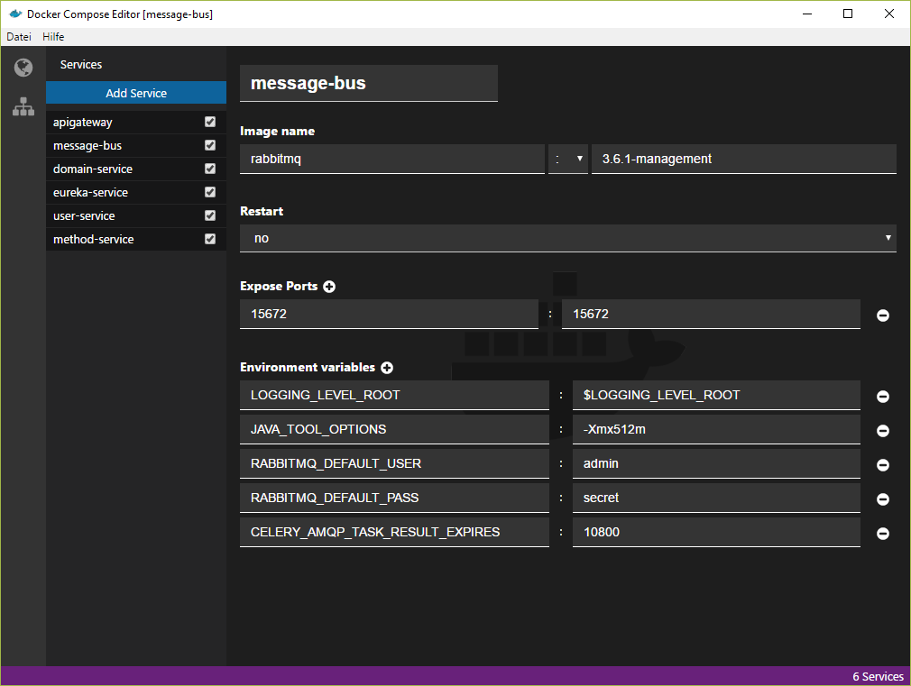
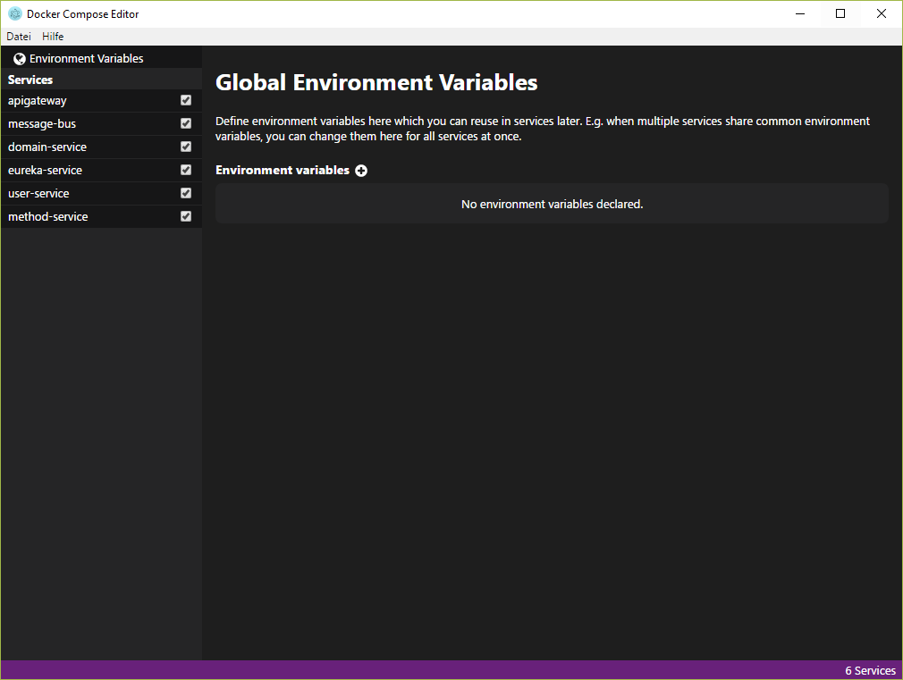

# Docker Compose Editor

Editing Docker Compose files may be very frustrating when havin a lot of services bundled together.
In the name of simplicity, this Docker Compose Editor is implemented.
Since it is not ready to ship, yet, here is a screenshot for you.

## Screenshots

